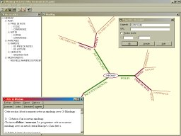



## GMindmap v0\.6

### Description

Software of creation and edition of mindmap; Propose the import and the export of data, the impression and the personalisation of Mindmaps. Software including a help file and its RTF source, a file of resource, various controls and advanced techniques
 
### More Info
 

             |
---                |---
**Submitted On**   |2000-09-01 14:30:04
**By**             |[C\.Dutoit](https://github.com/Planet-Source-Code/PSCIndex/blob/master/ByAuthor/c-dutoit.md)
**Level**          |Intermediate
**User Rating**    |4.8 (19 globes from 4 users)
**Compatibility**  |VB 5\.0, VB 6\.0
**Category**       |[Complete Applications](https://github.com/Planet-Source-Code/PSCIndex/blob/master/ByCategory/complete-applications__1-27.md)
**World**          |[Visual Basic](https://github.com/Planet-Source-Code/PSCIndex/blob/master/ByWorld/visual-basic.md)
**Archive File**   |[CODE\_UPLOAD9493912000\.zip](https://github.com/Planet-Source-Code/c-dutoit-gmindmap-v0-6__1-11157/archive/master.zip)

